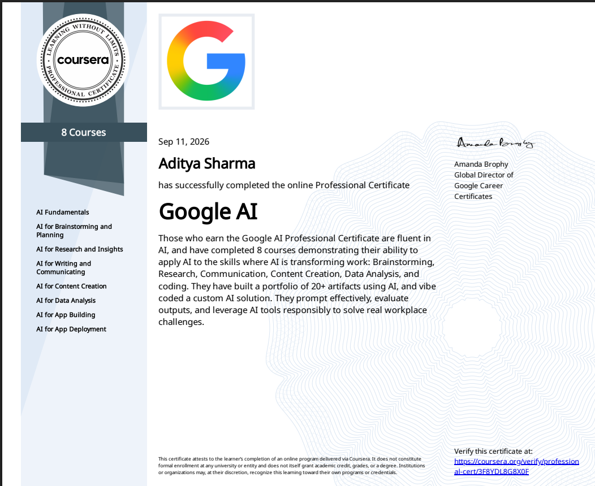

# 🧠 Google AI Professional Certificate

### 8 Courses · 1 Certificate · A Real Portfolio of AI Work

📄 [**View Certificate (PDF)**](certificate.pdf) &nbsp;|&nbsp; 🔗 [**Verify on Coursera**](https://coursera.org/verify/professional-cert/3F8YDL8G8X0F)

---

## 📜 The Certificate

  

---

## 👋 About This

A few weeks ago, using AI meant asking a chatbot to write an email.
Now there's a portfolio of **20+ AI-built artifacts** and a custom, vibe-coded
AI solution behind me — and a certificate to show for it.

This repository documents the completion of the **Google AI Professional
Certificate** — an 8-course program by **Google Career Certificates**, built
around one idea: AI isn't a novelty, it's a skill for real work.

---

## 🗺️ The 8 Courses

| # | Course | Duration | Focus |
|:-:|--------|:--------:|-------|
| 🌱 | **AI Fundamentals** | 3 hrs | What AI actually is, beyond the hype |
| 💡 | **AI for Brainstorming and Planning** | 1 hr | Using AI as a thinking partner |
| 🔍 | **AI for Research and Insights** | 1 hr | Turning AI into a research assistant |
| ✍️ | **AI for Writing and Communicating** | 1 hr | Prompting for tone, clarity, audience |
| 🎨 | **AI for Content Creation** | 2 hrs | Generating and refining real content |
| 📊 | **AI for Data Analysis** | 1 hr | Making sense of data with AI |
| 🛠️ | **AI for App Building** | 2 hrs | Vibe-coding an actual working app |
| 🚀 | **AI for App Deployment** | 2 hrs | Shipping it responsibly |

📁 <b>Click for a plain list</b>

- AI Fundamentals
- AI for Brainstorming and Planning
- AI for Research and Insights
- AI for Writing and Communicating
- AI for Content Creation
- AI for Data Analysis
- AI for App Building
- AI for App Deployment

---

## 🎓 Certificate Details

| | |
|---|---|
| **Certificate** | Google AI Professional Certificate |
| **Issued by** | Google Career Certificates (via Coursera) |
| **Completed by** | Aditya Sharma |
| **Completed on** | September 11, 2026 |
| **Verification link** | [coursera.org/verify/professional-cert/3F8YDL8G8X0F](https://coursera.org/verify/professional-cert/3F8YDL8G8X0F) |

---

## 📌 Key Takeaways

- 🎯 Prompting effectively — not just asking, but iterating toward better outputs
- 🔎 Evaluating AI outputs critically instead of trusting them blindly
- 🧩 Applying AI across research, writing, content, and data workflows
- 🚀 Building and deploying a real AI-powered app, end to end

---

⭐ **If you're on a similar AI learning path, feel free to fork this repo structure for your own log.**

